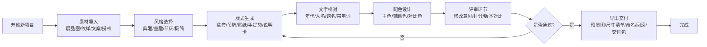

## 1. 产品概述

博物馆文创设计自动化平台，为博物馆文创团队提供一站式纪念品包装设计解决方案，通过7个标准化工作模块，实现从素材导入到批量导出的全流程自动化，大幅提升文创产品设计效率与质量。

- 解决博物馆文创团队设计效率低、风格不统一、审核流程繁琐的痛点
- 目标用户：博物馆文创设计师、产品经理、品牌审核人员
- 市场价值：赋能传统文化IP的数字化转化，让博物馆藏品以更现代的方式走进大众生活

## 2. 核心功能

### 2.1 用户角色

| 角色 | 注册方式 | 核心权限 |
|------|----------|----------|
| 设计师 | 账号登录 | 素材管理、风格选择、版式生成、配色设计 |
| 审核员 | 账号登录 | 文字校对、评审打分、版本对比 |
| 管理员 | 账号登录 | 全功能权限、导出管理、历史版本回溯 |

### 2.2 功能模块

1. **素材导入模块**：展品图上传、纹样库管理、文案录入、授权范围设置
2. **风格选择模块**：典雅、童趣、节庆、极简四种设计风格一键切换
3. **版式生成模块**：盒套、吊牌、贴纸、手提袋、说明卡五种包装版式自动生成
4. **文字校对模块**：年代校验、人名校验、馆名校验、禁用词检测
5. **配色模块**：主色提取、辅助色生成、对比色方案推荐
6. **评审模块**：修改意见收集、打分系统、版本对比
7. **导出模块**：预览图批量输出、尺寸清单生成、规范文件命名、历史回滚、交付包打包

### 2.3 页面详情

| 页面名称 | 模块名称 | 功能描述 |
|-----------|-------------|---------------------|
| 首页/工作台 | 项目概览 | 展示当前项目进度、快捷入口、最近编辑记录 |
| 素材管理页 | 素材导入 | 展品图拖拽上传、纹样分类管理、文案编辑器、授权范围表单 |
| 风格设计页 | 风格选择+版式生成 | 风格卡片切换预览、五种版式实时渲染、3D包装效果展示 |
| 文字校对页 | 文字校对 | 自动扫描标记问题、修改建议、一键修复、历史记录 |
| 配色中心页 | 配色模块 | 主色智能提取、色板生成、对比度检测、配色方案保存 |
| 评审协作页 | 评审模块 | 评论标注、星级打分、版本并排对比、意见汇总 |
| 导出中心页 | 导出模块 | 批量预览、规格参数表、命名规则设置、历史版本管理、一键打包下载 |

## 3. 核心流程

## 4. 用户界面设计

### 4.1 设计风格

- **设计理念**：文博雅致风，融合传统美学与现代设计语言，体现博物馆文化底蕴
- **主色调**：深朱砂红 #8B2323 作为主色，象征传统文化的厚重感
- **辅助色**：米杏色 #F5F0E6 作为背景色，营造温润典雅的视觉感受
- **点缀色**：石青色 #1F4E5F 用于强调元素，增添沉稳典雅气质
- **字体**：标题使用"思源宋体"，正文使用"思源黑体"，体现排版美感与可读性
- **按钮风格**：圆角矩形（8px），微浮雕效果，悬停时有微妙的色彩变化
- **布局风格**：卡片式布局，清晰的模块划分，充足的留白，强调内容层次
- **图标风格**：线性图标，采用统一的2px线条，融入传统纹样元素

### 4.2 页面设计概览

| 页面名称 | 模块名称 | UI元素 |
|-----------|-------------|-------------|
| 首页/工作台 | 项目概览 | 渐变装饰背景、项目卡片网格、快捷操作栏、进度条组件、动效过渡 |
| 素材管理页 | 素材导入 | 拖拽上传区域、文件缩略图网格、标签分类栏、表单输入组、上传进度动画 |
| 风格设计页 | 风格选择+版式生成 | 大尺寸风格预览卡、3D包装展示区、版式切换标签、实时渲染动效、鼠标悬停形变 |
| 文字校对页 | 文字校对 | 文本编辑器、错误高亮标记、建议气泡框、修复按钮、检查进度环 |
| 配色中心页 | 配色模块 | 色卡瀑布流、取色器组件、对比度检测条、方案保存卡片、色彩过渡动效 |
| 评审协作页 | 评审模块 | 双栏对比视图、评论标注系统、星级评分组件、意见汇总面板、版本切换动画 |
| 导出中心页 | 导出模块 | 批量预览网格、规格参数表格、命名规则配置器、历史时间线、打包下载进度 |

### 4.3 响应式设计

- **设计策略**：桌面端优先（1280px起），向下适配平板（768px）和移动端（375px）
- **断点设置**：lg(1024px)、md(768px)、sm(640px)
- **布局适配**：侧边栏在移动端转为底部Tab导航，多列布局转为单列堆叠
- **交互适配**：桌面端支持悬停效果，移动端转为点击触发，手势滑动切换视图

### 4.4 微交互与动效

- **页面入场**：模块淡入上移动画，stagger延迟创造层次感
- **卡片交互**：悬停时轻微上浮+阴影加深，点击时有按压反馈
- **加载状态**：骨架屏脉冲动画，数据加载完成后平滑过渡
- **切换动效**：风格切换时使用交叉溶解过渡，营造无缝衔接感
- **成功反馈**：操作完成后展示优雅的打勾动画，增强用户愉悦感
