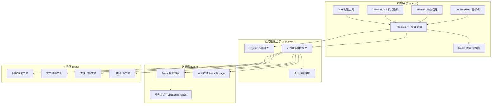
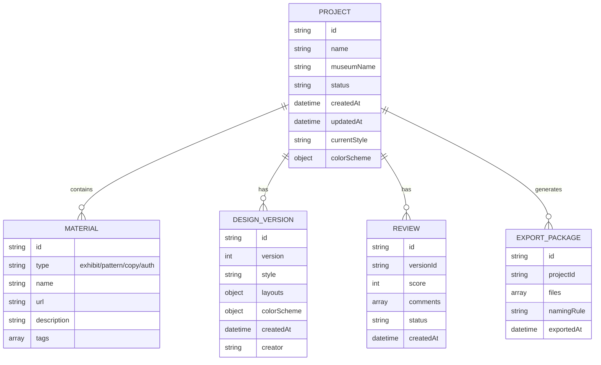

## 1. 架构设计



## 2. 技术描述

- **前端框架**：React@18 + TypeScript
- **构建工具**：Vite@5
- **样式方案**：TailwindCSS@3 + CSS变量主题系统
- **状态管理**：Zustand，管理项目全局状态（当前项目、设计数据、历史版本）
- **路由管理**：React Router DOM@6
- **图标库**：Lucide React
- **后端**：无后端，纯前端实现，使用LocalStorage持久化数据
- **数据模拟**：内置Mock数据，提供完整的演示素材和示例项目

## 3. 路由定义

| 路由路径 | 页面名称 | 模块功能 |
|----------|----------|----------|
| `/` | 首页/工作台 | 项目概览、快捷入口、进度展示 |
| `/material` | 素材管理页 | 展品图、纹样、文案、授权范围导入 |
| `/style` | 风格设计页 | 风格选择、版式生成、实时预览 |
| `/proofread` | 文字校对页 | 年代、人名、馆名、禁用词检查 |
| `/color` | 配色中心页 | 主色、辅助色、对比色方案生成 |
| `/review` | 评审协作页 | 修改意见、打分、版本对比 |
| `/export` | 导出中心页 | 预览图、尺寸清单、命名、回滚、交付包 |

## 4. 核心数据模型

### 4.1 数据模型定义



### 4.2 TypeScript 类型定义

```typescript
// 项目类型
interface Project {
  id: string;
  name: string;
  museumName: string;
  status: 'draft' | 'designing' | 'reviewing' | 'completed';
  createdAt: string;
  updatedAt: string;
  currentStyle: 'elegant' | 'playful' | 'festive' | 'minimal';
  colorScheme: ColorScheme;
  materials: Material[];
  versions: DesignVersion[];
}

// 素材类型
interface Material {
  id: string;
  type: 'exhibit' | 'pattern' | 'copy' | 'auth';
  name: string;
  url?: string;
  content?: string;
  description: string;
  tags: string[];
  authScope?: string[];
}

// 配色方案
interface ColorScheme {
  primary: string;
  secondary: string[];
  contrast: string[];
  name: string;
}

// 设计版本
interface DesignVersion {
  id: string;
  version: number;
  style: string;
  layouts: Layout[];
  colorScheme: ColorScheme;
  createdAt: string;
  creator: string;
}

// 版式类型
interface Layout {
  type: 'box' | 'tag' | 'sticker' | 'bag' | 'card';
  name: string;
  size: { width: number; height: number; unit: string };
  previewUrl: string;
  elements: LayoutElement[];
}

// 评审类型
interface Review {
  id: string;
  versionId: string;
  score: number;
  comments: ReviewComment[];
  status: 'pending' | 'approved' | 'rejected';
  createdAt: string;
}

// 导出配置
interface ExportConfig {
  formats: string[];
  namingRule: string;
  includeSpec: boolean;
  includePreview: boolean;
}
```

## 5. 状态管理设计

### 5.1 Zustand Store 结构

```typescript
// useProjectStore
{
  currentProject: Project | null;
  projects: Project[];
  activeTab: string;
  
  // Actions
  setCurrentProject: (id: string) => void;
  updateProject: (data: Partial<Project>) => void;
  addMaterial: (material: Material) => void;
  removeMaterial: (id: string) => void;
  setStyle: (style: string) => void;
  generateLayouts: () => void;
  setColorScheme: (scheme: ColorScheme) => void;
  saveVersion: () => void;
  rollbackVersion: (versionId: string) => void;
  exportPackage: (config: ExportConfig) => Promise<void>;
}
```

## 6. 目录结构

```
src/
├── components/           # 通用组件
│   ├── Layout/          # 布局组件
│   │   ├── Header.tsx
│   │   ├── Sidebar.tsx
│   │   └── index.tsx
│   ├── ui/              # 基础UI组件
│   │   ├── Button.tsx
│   │   ├── Card.tsx
│   │   ├── Input.tsx
│   │   ├── Modal.tsx
│   │   ├── Tabs.tsx
│   │   └── Upload.tsx
│   └── common/          # 业务通用组件
│       ├── MaterialCard.tsx
│       ├── VersionTimeline.tsx
│       ├── ColorPicker.tsx
│       └── PreviewCanvas.tsx
├── pages/               # 页面组件
│   ├── Dashboard.tsx
│   ├── Material.tsx
│   ├── StyleDesign.tsx
│   ├── Proofread.tsx
│   ├── ColorScheme.tsx
│   ├── Review.tsx
│   └── Export.tsx
├── store/               # 状态管理
│   └── useProjectStore.ts
├── types/               # 类型定义
│   └── index.ts
├── utils/               # 工具函数
│   ├── colorUtils.ts
│   ├── proofreadUtils.ts
│   ├── exportUtils.ts
│   └── mockData.ts
├── hooks/               # 自定义Hooks
│   ├── useDragDrop.ts
│   └── useLocalStorage.ts
├── App.tsx
├── main.tsx
└── index.css
```

## 7. 关键技术实现点

1. **配色算法**：基于展品图像素分析提取主色调，使用HSL色彩空间生成和谐的辅助色和对比色方案
2. **版式生成**：根据选择的风格和素材，使用预设模板系统动态生成五种包装版式
3. **文字校对**：内置博物馆专有名词库、年代范围校验、敏感词过滤规则
4. **版本管理**：使用不可变数据结构实现设计版本的完整历史记录和一键回滚
5. **文件导出**：使用Canvas API生成预览图，JSZip打包交付文件
6. **响应式设计**：TailwindCSS断点系统，支持桌面到移动端的完整适配
7. **动画系统**：CSS Transition + Framer Motion（如需要）实现流畅的页面过渡和微交互
